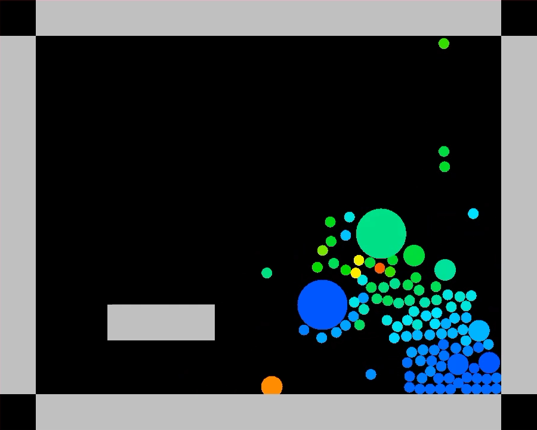

# sharpPhysics
Simple C# 2D physics engine written on top of [LeoECS](https://github.com/Leopotam/ecs) framework just for training.   
Look at Engine/Example/Example to understand what a hell is going on.

Use WASD to move attractor

